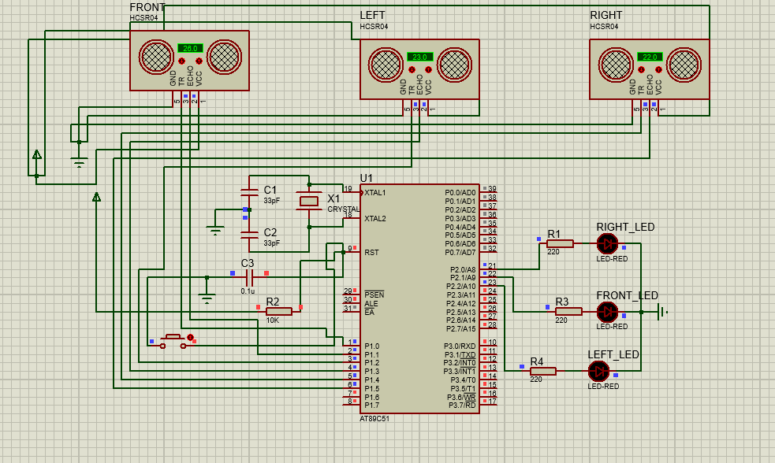
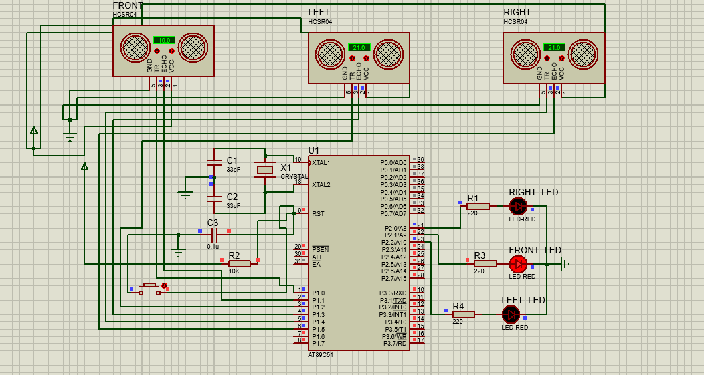
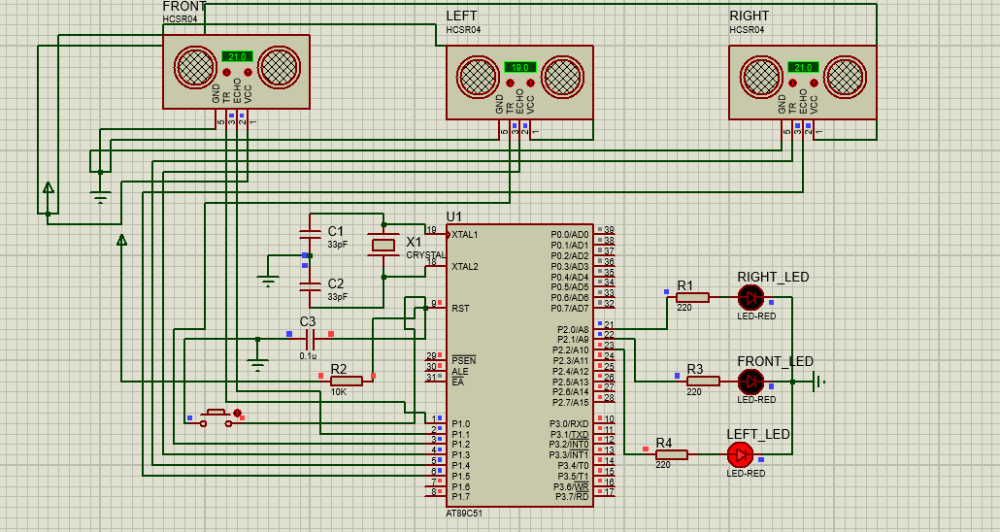
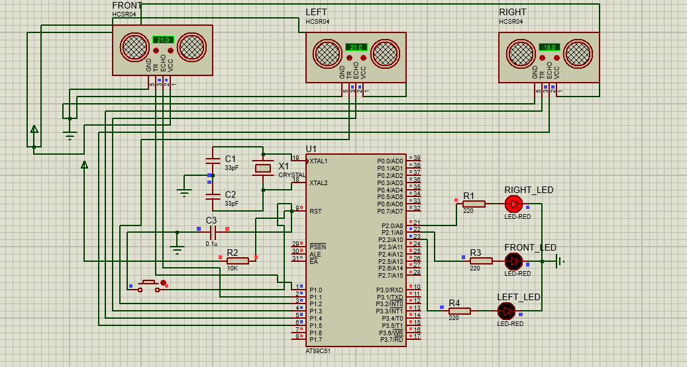
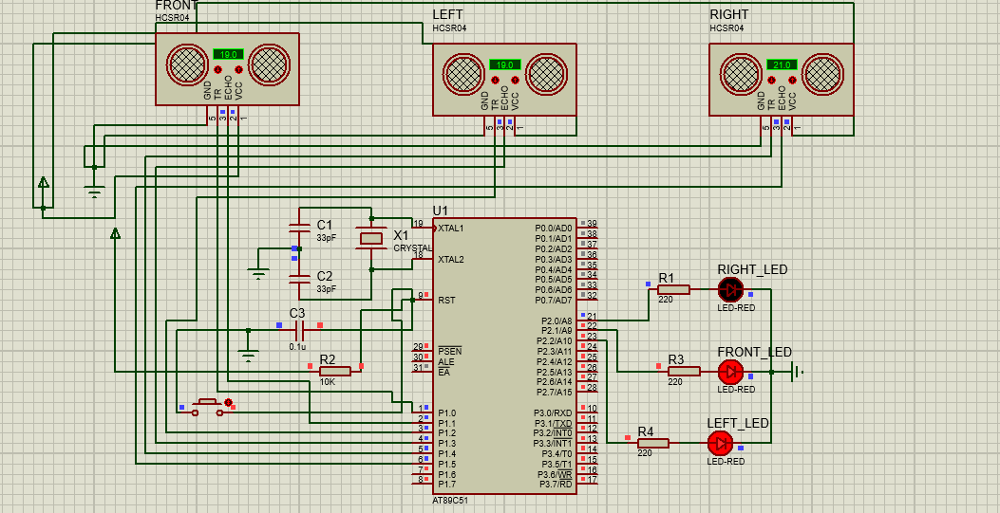
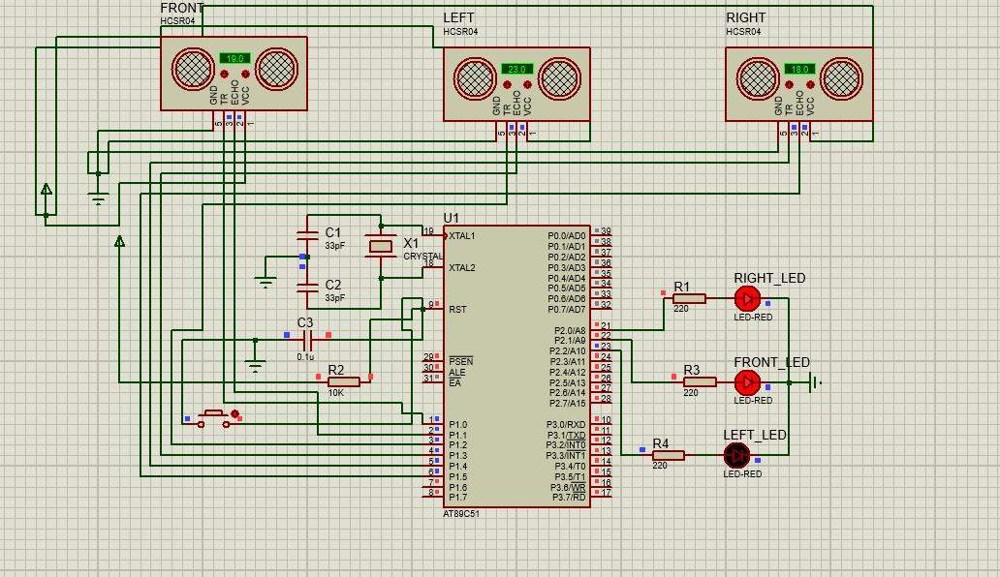
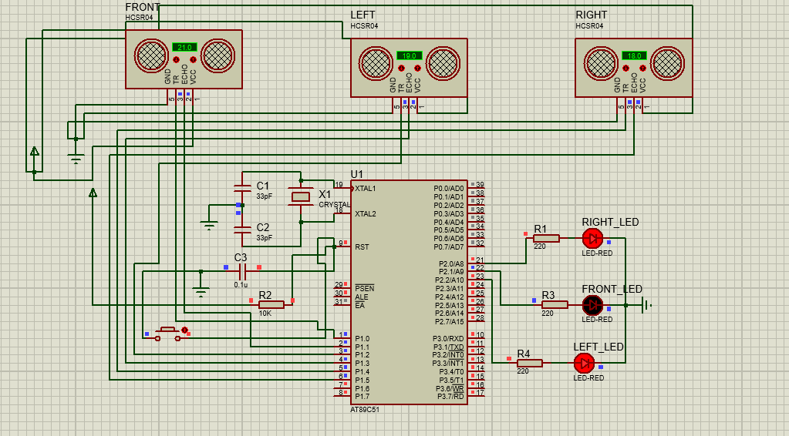
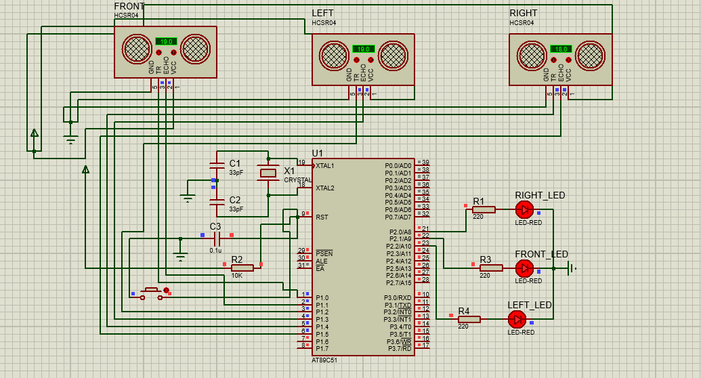

# 🚧 Three-Directional Obstacle Detection System

An AT89C51 (8051) based embedded system that detects obstacles in the **front**, **left**, and **right** directions using three HC-SR04 ultrasonic sensors. The system measures distance using **Timer0** and indicates nearby obstacles through dedicated LEDs.

> **Designed and simulated in Proteus using Embedded C (Keil uVision).**

---

## 📸 Project Preview

### Circuit Diagram


---

## 📖 Project Overview

This project demonstrates multi-directional obstacle detection using the AT89C51 microcontroller. Three ultrasonic sensors continuously monitor the surroundings, and the measured distance is compared against a predefined threshold.

If an obstacle is detected within **20 cm**, the corresponding LED turns ON.

This project was developed to strengthen concepts in:

- Embedded C Programming
- 8051 Microcontroller Programming
- Timer0
- GPIO Programming
- Ultrasonic Sensor Interfacing
- Proteus Simulation

---

## ✨ Features

- Detects obstacles in three directions:
  - Front
  - Left
  - Right
- Uses Timer0 for accurate echo pulse measurement
- Independent LED indication for each direction
- Timeout protection to prevent program hanging
- Modular Embedded C code
- Simulated in Proteus
- Compatible with Keil uVision

---

## 🛠 Hardware Components

| Component | Quantity |
|-----------|---------:|
| AT89C51 Microcontroller | 1 |
| HC-SR04 Ultrasonic Sensor | 3 |
| LEDs | 3 |
| 220Ω Resistors | 3 |
| Crystal Oscillator (11.0592 MHz) | 1 |
| 33pF Capacitors | 2 |
| Reset Push Button | 1 |
| 10kΩ Resistor | 1 |
| 0.1µF Capacitor | 1 |

---

## 🔌 Pin Configuration

### Ultrasonic Sensors

| Sensor | Trigger | Echo |
|---------|---------|------|
| Front | P1.0 | P1.1 |
| Left | P1.2 | P1.3 |
| Right | P1.4 | P1.5 |

### LEDs

| LED | Pin |
|-----|-----|
| Right LED | P2.0 |
| Front LED | P2.1 |
| Left LED | P2.2 |

---

## ⚙️ Working Principle

1. Trigger the Front ultrasonic sensor.
2. Measure the Echo pulse width using Timer0.
3. Calculate the obstacle distance.
4. Repeat the same process for the Left and Right sensors.
5. Compare the measured distance with the predefined threshold (20 cm).
6. Turn ON the corresponding LED if an obstacle is detected.
7. Continuously repeat the process.

---

## 📂 Project Structure

```
Three-Directional-Obstacle-Detection-System/
│
├── Code/
│   └── Three_Directional_Obstacle_Detection.c
│
├── HEX/
│   └── Three_Directional_Obstacle_Detection.hex
│
├── Proteus/
│   └── Three_Directional_Obstacle_Detection.pdsprj
│
├── Images/
│   ├── circuit.png
│   ├── no_obstacle.png
│   ├── front_obstacle.png
│   ├── left_obstacle.png
│   ├── right_obstacle.png
│   ├── front_left_obstacle.png
│   ├── right_front_obstacle.png
│   ├── right_left_obstacle.png
│   └── all_obstacles.png
│
├── README.md
├── LICENSE
└── .gitignore
```

---

## 📷 Simulation Results

### No Obstacle



---

### Front Obstacle



---

### Left Obstacle



---

### Right Obstacle



---

### Front + Left



---

### Front + Right



---

### Left + Right



---

### All Obstacles



---

## 🧠 Concepts Learned

- Embedded C Programming
- AT89C51 Architecture
- GPIO Programming
- Timer0
- Distance Measurement
- HC-SR04 Interfacing
- Modular Code Design
- Proteus Simulation
- Keil uVision Project Development
- Git & GitHub Project Management

---

## 🚀 Future Improvements

- Add buzzer for audio alerts
- LCD/OLED display for distance monitoring
- Servo motor for automatic scanning
- UART communication for serial monitoring
- Data logging using EEPROM or SD card
- Port the project to STM32 using bare-metal programming
- Integrate FreeRTOS for multitasking

---

## 🧪 Development Environment

- IDE: Keil uVision 5
- Language: Embedded C
- Microcontroller: AT89C51
- Simulator: Proteus 8 Professional
- Operating System: Windows 11

---

## 👨‍💻 Author

**Ganesh**

Electronics and Communication Engineering (ECE)

Interested in:

- Embedded Systems
- Bare-Metal Programming
- Automotive Embedded Systems
- Embedded Linux
- Edge AI

GitHub:
https://github.com/Ganesh-645

---

## 📄 License

This project is licensed under the MIT License.

---

⭐ If you found this project useful, consider giving it a star!
